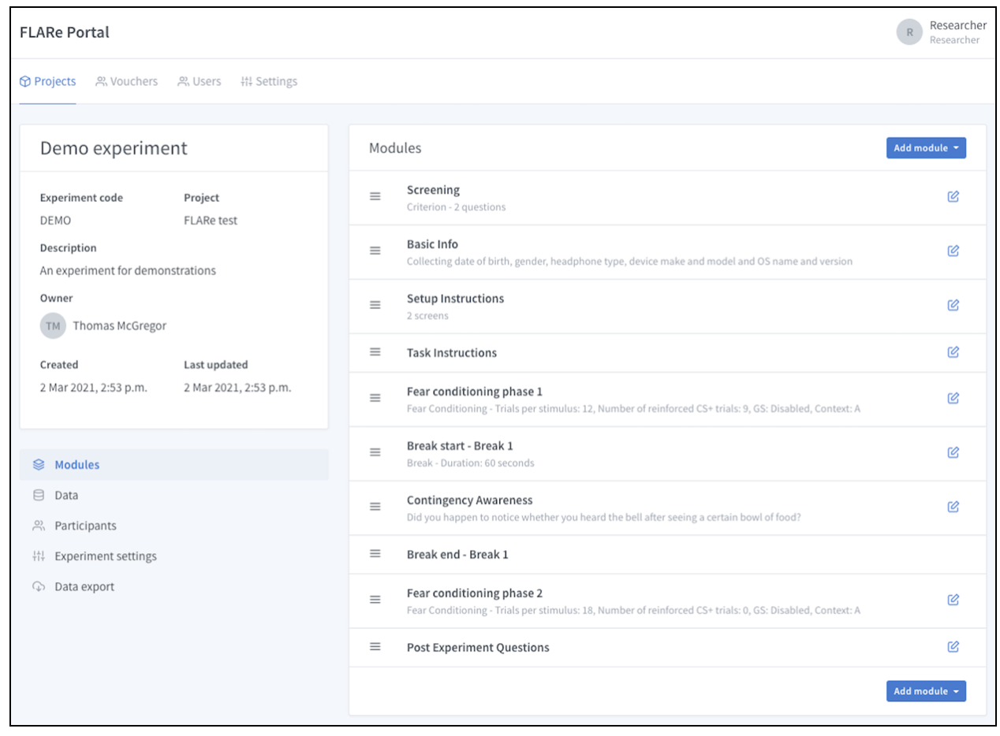

# Statement of need

‘Fear Learning and Anxiety Response’ (FLARe) is open-source software for conducting remote human fear conditioning studies using visual and auditory stimuli. Fear conditioning is a well-established experimental paradigm that relies on the paired presentation of neutral and aversive stimuli. The FLARe app enables this process through presentations of neutral visual stimuli and aversive auditory stimuli \autoref{fig:Basic fear conditioning trial}. Fear conditioning is a useful paradigm for modelling aspects of the development and exposure-based treatment of anxiety disorders [@Mineka:2008]. However, fear conditioning studies are traditionally carried out in the laboratory, which can limit the speed and quantity of data collection due to: i) limited availability of researcher man-hours, ii) a lack of ability to conduct simultaneous tests on multiple participants, and iii) participant travel requirements. FLARe has been designed to help enable the rapid, large-scale collection of fear conditioning data by removing these barriers associated with in-person testing. Remote fear conditioning using FLARe has been validated against an in-person assessment of fear conditioning [@Purves:2019].

{ width=60% }

# Summary

FLARe consists of an Android and iOS compatible smartphone app and associated web portal. The app delivers fear conditioning experiments to participants, while the portal enables researchers to set up experiments and view/export the resulting data. FLARe was designed for use by researchers with and without prior experience conducting fear conditioning studies. The portal \autoref{fig:FLARe portal screenshot} has a Graphical User Interface (GUI) that makes it simple for researchers to set up a range of flexible experiments using a number of purpose-built modules. Each module enables researchers to implement common operations, such as delivering instructions, displaying questionnaire items, or delivering a phase of the fear conditioning task. Researchers simply build their experiment using a combination of these modules and assign participant IDs to the experiment. Once this process is complete, participants can log in using their unique ID, which causes the app to download the settings of the related experiment. The current version of FLARe was developed to make the software open-source, more user friendly, and increase the number of experimental parameters that can be altered by researchers.

A number of studies have already been conducted using an earlier version of the app, with more set for the future using the current updated version. Existing, peer-reviewed articles include our validation work comparing the app against an in-person fear conditioning experiment [@Purves:2019] and demonstrations of the app’s ability to measure differences in fear conditioning related to anxiety [@McGregor:2021] and anorexia nervosa [@Lambert:2021]. More recently, a study using the app has been able to provide evidence of genetic and environmental associations between different measures of fear conditioning [@Purves:2020]. Further research is currently underway to establish FLARe’s ability to predict treatment response in anxious patients.

# Software information

FLARe software consists of two parts, a database/experiment management portal built using Python and Django while the native mobile application was built using Typescript and React Native that participants install on their phone to complete experiments. We chose Django as our backend infrastructure because it allowed us to quickly iterate and build a versatile module framework on top of Django’s Model-Template-View (MTV) structure. This means, for ongoing development or expansion, a developer only needs to write two model classes (a module definition model and a data collection model) to add their own custom modules to the FLARe portal without the need to write any custom API endpoints. On the frontend, we chose to use React Native because it allowed us to build the app cross-platform while also having the ability to write native Java or Swift code to capture more raw data for analysis post-experiment. Instead of relying solely on Javascript for our app code, we decided to use Typescript as a way of giving our codebase a more formal structure. The provided typings should allow new developers to quickly understand the module framework and prototype new features without getting confused in the data flow of the application.

A more in-depth technical description can be found: [here](https://docs.google.com/document/d/11GBzLfQ3bPkZqHHJNA9wDgRUs89Na2V7oKZGWzhvfDw/edit?usp=sharing).

## Local setup

The FLARe portal and app are kept in separate repositories which need to be cloned and run separately.

### Setup the FLARe portal development environment

- Clone the project: `git clone https://github.com/flare-kcl/flare-portal`
- Install fabric: `pip install fabric`
- Start docker and start shell: `fab start && fab sh`
- Start Django server: `djrun`

### Setup the FLARe app development environment

- Clone the project: `git clone https://github.com/flare-kcl/flare-app`
- Install NPM deps: `npm i`
- Check native dependencies and follow instructions: `npx @react-native-community/cli doctor`
- Install CocoaPods for iOS build: `cd ios && pod install`

### Running FLARe app

- For Android: `npm run android`
- For iOS: `npm run ios`

### Public deployment

The FLARe portal can easily be deployed on a service such as Heroku using the provider Docker container. However, releasing a custom version of the app will require you to change the `packageName` properties throughout the codebase and submit to both the App Store and Play Store under separate names. Configuration of the API endpoints used by the app can be done via a `.env` file in the root of the project. An example of this has been provided in the repository.

## King’s College London infrastructure

Researchers interested in using King’s College London’s existing infrastructure ‘FLARe Research’ to conduct their experiments can contact the FLARe team (flare@kcl.ac.uk). The FLARe team members are interested in supporting studies that comply with open science practices.

# Acknowledgements

T. McGregor is supported by the UK Medical Research Council (MR/N013700/1). T.C. Eley and G. Breen are part-funded by a program grant from the UK Medical Research Council (MR/M021475/1 and MR/V012878/1). This study presents independent research part-funded by the Wellcome Trust (221582/Z/20/Z) and National Institute for Health Research (NIHR) Biomedical Research Centre at South London and Maudsley NHS Foundation Trust and King’s College London. The views expressed are those of the author(s) and not necessarily those of the NHS, the NIHR or the Department of Health and Social Care.

# References
